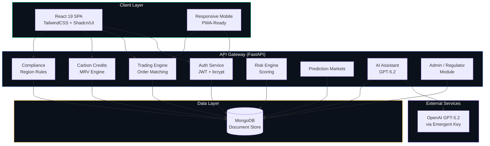
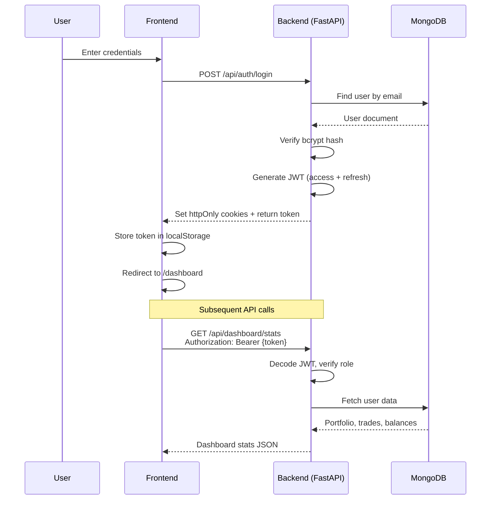
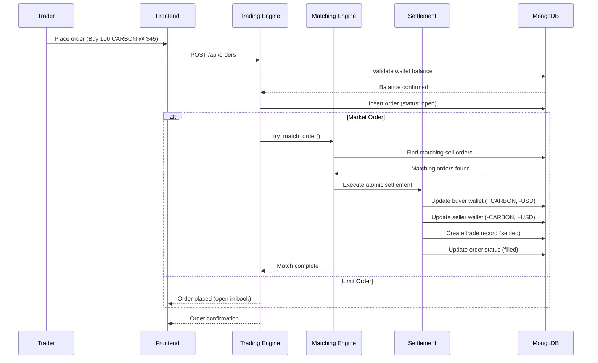
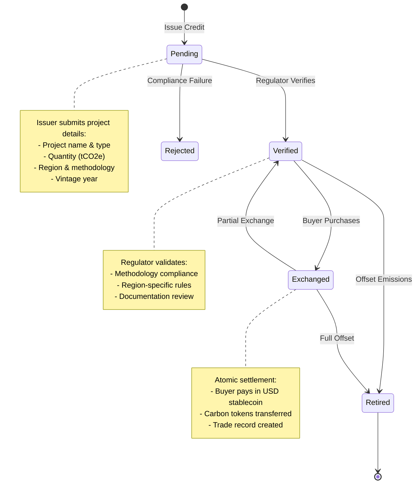
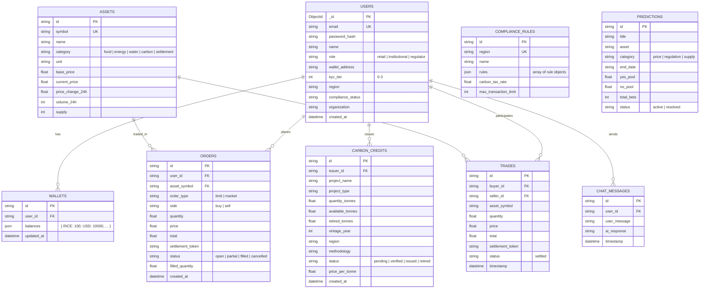
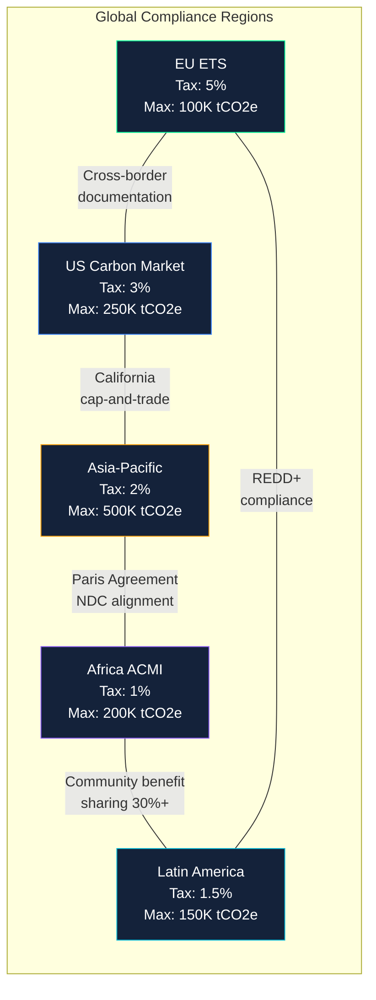

<div align="center">

# E4N — Exchange for Necessities

### A Sovereign-Grade, Tokenized, Instant-Settlement Exchange for Essential Goods & Carbon Credits

[](https://fastapi.tiangolo.com)
[](https://react.dev)
[](https://mongodb.com)
[](https://openai.com)
[](https://tailwindcss.com)
[](LICENSE)

<br />

**Trade essential commodities. Exchange carbon credits. Drive sustainable impact.**

E4N is a next-generation exchange platform enabling instant, trustless trading of essential goods (food, water, energy) and carbon credits through deterministic AI and tokenized settlement — built for institutions, regulators, and retail participants.

<br />

[Live Demo](#demo-credentials) · [Architecture](#system-architecture) · [Quick Start](#quick-start) · [API Reference](#api-reference) · [Deployment](#deployment)

</div>

---

## Table of Contents

- [Features](#features)
- [System Architecture](#system-architecture)
- [Tech Stack](#tech-stack)
- [Project Structure](#project-structure)
- [Quick Start](#quick-start)
- [Environment Variables](#environment-variables)
- [Demo Credentials](#demo-credentials)
- [API Reference](#api-reference)
- [Frontend Pages](#frontend-pages)
- [Carbon Credits Lifecycle](#carbon-credits-lifecycle)
- [Compliance & Regulations](#compliance--regulations)
- [AI Assistant](#ai-assistant)
- [Deployment](#deployment)
- [Testing](#testing)
- [Roadmap](#roadmap)
- [Contributing](#contributing)

---

## Features

| Category | Feature | Status |
|---|---|---|
| **Authentication** | JWT-based multi-role auth (retail, institutional, regulator) | ✅ |
| **Trading Engine** | Limit & market orders with matching engine | ✅ |
| **Carbon Credits** | Full lifecycle: Issue → Verify → Exchange → Retire | ✅ |
| **Compliance** | Region-based regulations (EU, US, APAC, AFRICA, LATAM) | ✅ |
| **Portfolio** | Wallet management, allocation charts, holdings | ✅ |
| **Risk Engine** | Risk scoring with factor analysis & recommendations | ✅ |
| **Prediction Markets** | Tokenized forecasting with probability-based betting | ✅ |
| **AI Assistant** | GPT-5.2 powered chat with market context | ✅ |
| **Regulator Dashboard** | System overview, credit verification, user compliance | ✅ |
| **Glassmorphism UI** | Dark theme with backdrop blur, responsive mobile-first | ✅ |
| **Seed Data** | Synthetic 90-day price history, users, trades, credits | ✅ |

---

## System Architecture

### High-Level Architecture



### Authentication Flow



### Trading Engine Flow



### Carbon Credit Lifecycle



### Database Schema



### Compliance Region Map



---

## Tech Stack

### Backend

| Technology | Purpose | Version |
|---|---|---|
| **Python** | Runtime | 3.11+ |
| **FastAPI** | Web framework / REST API | 0.110.1 |
| **Motor** | Async MongoDB driver | 3.3.1 |
| **MongoDB** | Document database | 7.x |
| **PyJWT** | JWT token management | 2.10+ |
| **bcrypt** | Password hashing | 4.1.3 |
| **Pydantic** | Data validation / serialization | 2.6+ |
| **emergentintegrations** | LLM integration (OpenAI GPT-5.2) | 0.1.0 |
| **uvicorn** | ASGI server | 0.25.0 |

### Frontend

| Technology | Purpose | Version |
|---|---|---|
| **React** | UI library | 19.0 |
| **React Router** | Client-side routing | 7.5 |
| **TailwindCSS** | Utility-first CSS | 3.4 |
| **Shadcn/UI** | Accessible component library | latest |
| **Recharts** | Chart library | 3.8 |
| **Framer Motion** | Animation library | 12.38 |
| **Axios** | HTTP client | 1.8 |
| **Lucide React** | Icon library | 0.507 |
| **Sonner** | Toast notifications | 2.0 |
| **date-fns** | Date utilities | 4.1 |

### Design System

| Element | Specification |
|---|---|
| **Theme** | Dark (#060B12 base) with glassmorphism |
| **Primary Font** | Cabinet Grotesk (headings) |
| **Body Font** | IBM Plex Sans |
| **Accent Color** | Emerald (#00F298) |
| **Glass Effect** | `backdrop-blur-2xl` + `bg-white/5` + `border-white/10` |
| **Animations** | Staggered fade-in via Framer Motion |

---

## Project Structure

```
e4n/
├── backend/
│   ├── .env                    # Backend environment variables
│   ├── requirements.txt        # Python dependencies
│   └── server.py               # FastAPI application (all endpoints)
│
├── frontend/
│   ├── .env                    # Frontend environment variables
│   ├── package.json            # Node.js dependencies
│   ├── tailwind.config.js      # Tailwind CSS configuration
│   ├── postcss.config.js       # PostCSS configuration
│   ├── public/                 # Static assets
│   └── src/
│       ├── index.js            # React entry point
│       ├── index.css           # Global styles + CSS variables
│       ├── App.js              # Router + AuthProvider + Toaster
│       ├── App.css             # Glassmorphism utilities + animations
│       ├── contexts/
│       │   └── AuthContext.js   # Auth state, login/register/logout, apiCall helper
│       ├── components/
│       │   ├── Layout.js       # Sidebar + main content + AI chat
│       │   ├── Sidebar.js      # Navigation sidebar
│       │   ├── AIChat.js       # AI assistant chat panel
│       │   └── ui/             # Shadcn/UI components (button, input, select, etc.)
│       └── pages/
│           ├── AuthPage.js     # Login / Register with demo accounts
│           ├── Dashboard.js    # Portfolio stats, charts, market overview
│           ├── Trading.js      # Order book, price chart, order form
│           ├── CarbonCredits.js # Carbon credit lifecycle management
│           ├── Portfolio.js    # Holdings, allocation, risk score
│           ├── Compliance.js   # Region-based regulations
│           ├── Predictions.js  # Prediction market cards
│           └── AdminDashboard.js # Regulator system overview
│
├── memory/
│   ├── PRD.md                  # Product Requirements Document
│   └── test_credentials.md     # Demo credentials
│
├── tests/                      # Test files
├── test_reports/               # Automated test results
└── README.md                   # This file
```

---

## Quick Start

### Prerequisites

- **Python 3.11+**
- **Node.js 18+** with **Yarn**
- **MongoDB 7.x** running locally (or connection string)

### 1. Clone the Repository

```bash
git clone https://github.com/your-org/e4n-exchange.git
cd e4n-exchange
```

### 2. Backend Setup

```bash
cd backend

# Create virtual environment
python -m venv venv
source venv/bin/activate  # Windows: venv\Scripts\activate

# Install dependencies
pip install -r requirements.txt

# Configure environment
cp .env.example .env
# Edit .env with your values (see Environment Variables section)

# Start the server
uvicorn server:app --host 0.0.0.0 --port 8001 --reload
```

The backend will:
- Connect to MongoDB
- Seed demo users, assets, carbon credits, compliance rules, and sample trades
- Start accepting API requests at `http://localhost:8001`

### 3. Frontend Setup

```bash
cd frontend

# Install dependencies
yarn install

# Configure environment
# Edit .env — set REACT_APP_BACKEND_URL to your backend URL

# Start development server
yarn start
```

The frontend will be available at `http://localhost:3000`

### 4. One-Command Start (Docker)

```bash
# If using Docker Compose (example docker-compose.yml)
docker-compose up --build
```

---

## Environment Variables

### Backend (`backend/.env`)

| Variable | Description | Example |
|---|---|---|
| `MONGO_URL` | MongoDB connection string | `mongodb://localhost:27017` |
| `DB_NAME` | Database name | `e4n_exchange` |
| `JWT_SECRET` | Secret key for JWT signing (64+ chars) | `your-super-secret-key-here` |
| `ADMIN_EMAIL` | Admin/regulator seed email | `regulator_1@e4n.com` |
| `ADMIN_PASSWORD` | Admin/regulator seed password | `Admin@123` |
| `EMERGENT_LLM_KEY` | OpenAI GPT-5.2 API key | `sk-emergent-...` |
| `FRONTEND_URL` | Frontend origin for CORS | `http://localhost:3000` |
| `CORS_ORIGINS` | Allowed CORS origins | `*` |

### Frontend (`frontend/.env`)

| Variable | Description | Example |
|---|---|---|
| `REACT_APP_BACKEND_URL` | Backend API base URL | `http://localhost:8001` |

---

## Demo Credentials

The database is auto-seeded with these accounts on first startup:

| Role | Email | Password | Wallet | Initial Tokens |
|---|---|---|---|---|
| **Retail Trader** | `retail_user_1@e4n.com` | `Test@123` | `0xRetail001` | RICE: 100, H2O: 500, USD: 10,000, CARBON: 5 |
| **Institutional** | `inst_buyer_1@e4n.com` | `Test@123` | `0xInst001` | USD: 1,000,000, CARBON: 1,000, WHEAT: 50,000 |
| **Farmer/Producer** | `farmer_1@e4n.com` | `Test@123` | `0xFarm001` | WHEAT: 10,000, RICE: 5,000, USD: 25,000, CARBON: 50 |
| **Regulator** | `regulator_1@e4n.com` | `Admin@123` | `0xReg001` | USD: 100,000 |

### Tradeable Assets

| Asset | Symbol | Category | Unit | Base Price |
|---|---|---|---|---|
| Rice Token | `RICE` | Food | kg | $0.85 |
| Wheat Token | `WHEAT` | Food | kg | $0.32 |
| Energy Token | `KWH` | Energy | kWh | $0.12 |
| Water Token | `H2O` | Water | liters | $0.005 |
| Carbon Credit | `CARBON` | Carbon | tCO2e | $45.00 |
| USD Stablecoin | `USD` | Settlement | USD | $1.00 |

---

## API Reference

Base URL: `{BACKEND_URL}/api`

### Authentication

| Method | Endpoint | Description | Auth |
|---|---|---|---|
| `POST` | `/api/auth/register` | Register new user | No |
| `POST` | `/api/auth/login` | Login with email/password | No |
| `POST` | `/api/auth/logout` | Logout (clear cookies) | No |
| `GET` | `/api/auth/me` | Get current user profile | Yes |
| `POST` | `/api/auth/refresh` | Refresh access token | Cookie |

#### Login Request
```json
POST /api/auth/login
{
  "email": "retail_user_1@e4n.com",
  "password": "Test@123"
}
```

#### Login Response
```json
{
  "id": "user_id",
  "email": "retail_user_1@e4n.com",
  "name": "Alex Chen",
  "role": "retail",
  "wallet_address": "0xRetail001",
  "kyc_tier": 1,
  "region": "EU",
  "compliance_status": "pending",
  "token": "eyJhbGciOiJIUzI1NiIs..."
}
```

### Assets & Market Data

| Method | Endpoint | Description | Auth |
|---|---|---|---|
| `GET` | `/api/assets` | List all tradeable assets | No |
| `GET` | `/api/assets/{symbol}` | Get asset details | No |
| `GET` | `/api/assets/{symbol}/price-history` | Get price history (30/60/90 days) | No |
| `GET` | `/api/dashboard/market-data` | All assets with price history | Yes |

### Trading

| Method | Endpoint | Description | Auth |
|---|---|---|---|
| `POST` | `/api/orders` | Place a new order | Yes |
| `GET` | `/api/orders` | List user's orders | Yes |
| `DELETE` | `/api/orders/{order_id}` | Cancel an open order | Yes |
| `GET` | `/api/orders/book/{symbol}` | Get order book for asset | No |
| `GET` | `/api/trades` | User's trade history | Yes |
| `GET` | `/api/trades/recent` | Recent market trades | No |

#### Place Order Request
```json
POST /api/orders
{
  "asset_symbol": "CARBON",
  "order_type": "limit",
  "side": "buy",
  "quantity": 100,
  "price": 45.50,
  "settlement_token": "USD"
}
```

### Carbon Credits

| Method | Endpoint | Description | Auth |
|---|---|---|---|
| `GET` | `/api/carbon-credits` | List all carbon credits | No |
| `POST` | `/api/carbon-credits` | Issue new credit project | Yes |
| `PUT` | `/api/carbon-credits/{id}/verify` | Verify credit (regulator only) | Regulator |
| `POST` | `/api/carbon-credits/{id}/retire` | Retire credit (offset emissions) | Yes |
| `POST` | `/api/carbon-credits/exchange` | Purchase carbon credits | Yes |
| `GET` | `/api/carbon-credits/stats` | Aggregated statistics | No |

#### Issue Carbon Credit
```json
POST /api/carbon-credits
{
  "project_name": "Amazon Rainforest Conservation",
  "project_type": "forestry",
  "quantity_tonnes": 5000,
  "vintage_year": 2026,
  "region": "LATAM",
  "methodology": "REDD+",
  "description": "Forest conservation project in Amazon basin"
}
```

#### Exchange Carbon Credits
```json
POST /api/carbon-credits/exchange
{
  "credit_id": "credit-uuid",
  "quantity_tonnes": 100,
  "price_per_tonne": 45.00,
  "settlement_token": "USD"
}
```

### Compliance

| Method | Endpoint | Description | Auth |
|---|---|---|---|
| `GET` | `/api/compliance/regions` | List all compliance regions | No |
| `GET` | `/api/compliance/rules` | Get rules (optional `?region=EU`) | No |
| `GET` | `/api/compliance/status` | User's compliance status | Yes |

### Portfolio & Risk

| Method | Endpoint | Description | Auth |
|---|---|---|---|
| `GET` | `/api/wallet` | Get user wallet balances | Yes |
| `GET` | `/api/portfolio` | Full portfolio with holdings | Yes |
| `GET` | `/api/risk/score` | User risk score & recommendations | Yes |
| `GET` | `/api/risk/market` | Market risk indicators | No |
| `GET` | `/api/dashboard/stats` | Dashboard summary stats | Yes |

### Prediction Markets

| Method | Endpoint | Description | Auth |
|---|---|---|---|
| `GET` | `/api/predictions` | List active prediction markets | No |
| `POST` | `/api/predictions/{id}/bet` | Place a bet (yes/no) | Yes |

#### Place Bet
```json
POST /api/predictions/{id}/bet
{
  "position": "yes",
  "amount": 100
}
```

### AI Chat

| Method | Endpoint | Description | Auth |
|---|---|---|---|
| `POST` | `/api/chat` | Send message to AI assistant | Yes |
| `GET` | `/api/chat/history` | Get chat history | Yes |

### Admin (Regulator Only)

| Method | Endpoint | Description | Auth |
|---|---|---|---|
| `GET` | `/api/admin/users` | List all registered users | Regulator |
| `GET` | `/api/admin/trades` | View all system trades | Regulator |
| `GET` | `/api/admin/reports` | System-wide reports | Regulator |
| `PUT` | `/api/admin/users/{id}/compliance` | Update user compliance status | Regulator |

---

## Frontend Pages

### 1. Authentication (`/auth`)
- Split-screen layout: branding panel + login/register form
- Demo account quick-fill buttons
- Role selection for registration (retail / institutional)

### 2. Dashboard (`/dashboard`)
- Portfolio value, trade count, open orders, carbon balance stat cards
- Carbon credit price chart (30-day area chart)
- Trading volume bar chart
- Market overview (all assets with 24h change)
- Recent market trades

### 3. Trading (`/trading`)
- Asset selector bar (RICE, WHEAT, KWH, H2O, CARBON)
- Real-time price chart with change indicator
- Order book (bids & asks)
- Recent trades for selected asset
- Order form: Buy/Sell toggle, limit/market, price, quantity
- Open orders with cancel button

### 4. Carbon Credits (`/carbon-credits`)
- Stats cards: total credits, total tonnes, retired, offset rate
- Pie chart: distribution by region
- Bar chart: distribution by project type
- Issue new credit form
- Exchange dialog
- Credits table with actions (verify/exchange/retire)

### 5. Portfolio (`/portfolio`)
- Total portfolio value
- Allocation pie chart
- Risk assessment gauge (score 0–100, low/medium/high)
- Holdings table with categories and 24h change
- Recent trade activity

### 6. Compliance (`/compliance`)
- User compliance status card
- Region filter
- Region cards with:
  - Carbon tax rate and max transaction limit
  - Individual rules with severity badges (critical/high/medium/low)

### 7. Predictions (`/predictions`)
- Prediction market cards with:
  - Category badge (price/regulation/supply)
  - Probability bar (yes/no split)
  - Pool sizes
  - Betting interface

### 8. Regulator Dashboard (`/admin`)
- System stats (users, trades, volume, credits)
- Pending carbon credit verification queue
- Registered users table with compliance approval
- Recent system trades

---

## Carbon Credits Lifecycle

```
┌─────────────┐    ┌───────────┐    ┌──────────────┐    ┌──────────┐
│   ISSUER    │───▶│  PENDING  │───▶│   VERIFIED   │───▶│ EXCHANGED│
│             │    │           │    │              │    │          │
│ Submit      │    │ Awaiting  │    │ Regulator    │    │ Buyer    │
│ project     │    │ review    │    │ approved     │    │ purchased│
│ details     │    │           │    │              │    │          │
└─────────────┘    └───────────┘    └──────┬───────┘    └──────────┘
                                           │
                                           ▼
                                    ┌──────────────┐
                                    │   RETIRED    │
                                    │              │
                                    │ Emissions    │
                                    │ offset       │
                                    └──────────────┘
```

### Supported Project Types
- **Forestry** — REDD+, afforestation, deforestation prevention
- **Renewable Energy** — Solar, wind, hydro projects
- **Methane Capture** — Landfill gas, coal mine methane
- **Energy Efficiency** — Cookstoves, industrial optimization
- **Blue Carbon** — Mangrove restoration, seagrass conservation

### Supported Methodologies
- REDD+ (Reducing Emissions from Deforestation)
- Gold Standard
- Verra VCS (Verified Carbon Standard)
- CDM (Clean Development Mechanism)
- ACR (American Carbon Registry)
- Plan Vivo
- J-Credit (Japan)
- CCER (China)

---

## Compliance & Regulations

### Region-Based Rules

| Region | Carbon Tax | Max Transaction | Key Requirements |
|---|---|---|---|
| **EU** | 5.0% | 100,000 tCO2e | EU-approved methodology, quarterly reporting |
| **US** | 3.0% | 250,000 tCO2e | SEC registration (institutional), KYC/AML mandatory |
| **APAC** | 2.0% | 500,000 tCO2e | Paris Agreement NDC alignment |
| **AFRICA** | 1.0% | 200,000 tCO2e | Community benefit sharing (min 30%) |
| **LATAM** | 1.5% | 150,000 tCO2e | REDD+ compliance, indigenous consent |

---

## AI Assistant

The E4N AI Assistant is powered by **OpenAI GPT-5.2** and has real-time context about:
- Current market prices for all assets
- User's portfolio and wallet balances
- User's role and compliance region
- Carbon credit market data

### Example Queries
- "What's the current outlook for carbon credits?"
- "Should I diversify my portfolio into energy tokens?"
- "Explain the EU ETS compliance requirements"
- "What are the risks of holding concentrated WHEAT positions?"
- "How does atomic settlement work?"

---

## Deployment

### Using Docker

```dockerfile
# Backend Dockerfile
FROM python:3.11-slim
WORKDIR /app
COPY backend/requirements.txt .
RUN pip install -r requirements.txt
COPY backend/ .
CMD ["uvicorn", "server:app", "--host", "0.0.0.0", "--port", "8001"]
```

```dockerfile
# Frontend Dockerfile
FROM node:18-alpine
WORKDIR /app
COPY frontend/package.json frontend/yarn.lock ./
RUN yarn install --frozen-lockfile
COPY frontend/ .
RUN yarn build
# Serve with nginx or similar
```

### Docker Compose

```yaml
version: '3.8'
services:
  mongodb:
    image: mongo:7
    ports:
      - "27017:27017"
    volumes:
      - mongo_data:/data/db

  backend:
    build: ./backend
    ports:
      - "8001:8001"
    env_file: ./backend/.env
    depends_on:
      - mongodb

  frontend:
    build: ./frontend
    ports:
      - "3000:3000"
    env_file: ./frontend/.env
    depends_on:
      - backend

volumes:
  mongo_data:
```

### Environment-Specific Notes

- **Development**: Backend auto-seeds demo data on startup
- **Production**: Set `JWT_SECRET` to a cryptographically random 64-char hex string
- **CORS**: Set `FRONTEND_URL` to your production frontend domain
- **Database**: Use MongoDB Atlas or a managed MongoDB service

---

## Testing

### Backend API Tests

```bash
# Run the automated test suite
cd backend
python -m pytest ../tests/ -v

# Quick API check
curl -X POST http://localhost:8001/api/auth/login \
  -H "Content-Type: application/json" \
  -d '{"email":"retail_user_1@e4n.com","password":"Test@123"}'
```

### Frontend Tests

```bash
cd frontend
yarn test
```

### Test Reports

Automated test reports are generated at `/test_reports/`:
- `iteration_1.json` — Full E2E test results
- `backend_api_results.json` — API endpoint test results

---

## Roadmap

### Phase 1 — MVP (Completed)
- [x] JWT authentication with role-based access
- [x] Trading engine with order matching
- [x] Carbon credit lifecycle (Issue → Verify → Exchange → Retire)
- [x] Region-based compliance module
- [x] Portfolio & risk management
- [x] Prediction markets
- [x] AI chat assistant (GPT-5.2)
- [x] Glassmorphism responsive UI

### Phase 2 — Enhanced Trading
- [ ] WebSocket real-time price updates
- [ ] Candlestick charts with technical indicators
- [ ] Advanced order types (conditional, basket, stop-loss)
- [ ] KYC document upload workflow
- [ ] Notification system (email, in-app)

### Phase 3 — Enterprise Features
- [ ] Carbon offset calculator for institutions
- [ ] PDF certificate generation for verified credits
- [ ] Export reports (CSV/PDF) for compliance
- [ ] Multi-factor authentication
- [ ] Smart contract simulation for settlements

### Phase 4 — Scale & Integrate
- [ ] Blockchain layer (Ethereum-compatible testnet)
- [ ] DAO governance module
- [ ] IoT warehouse tokenization
- [ ] Mobile app (React Native)
- [ ] Multi-language support

---

## Contributing

1. Fork the repository
2. Create your feature branch (`git checkout -b feature/amazing-feature`)
3. Commit changes (`git commit -m 'Add amazing feature'`)
4. Push to the branch (`git push origin feature/amazing-feature`)
5. Open a Pull Request

---

## License

This project is licensed under the MIT License — see the [LICENSE](LICENSE) file for details.

---

<div align="center">

**Built with purpose. Traded with trust. Settled with certainty.**

*E4N — Exchange for Necessities*

</div>
